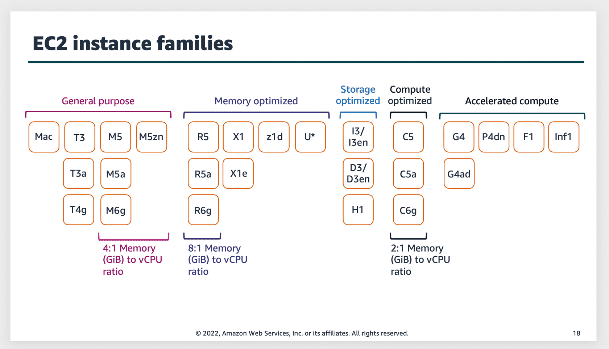
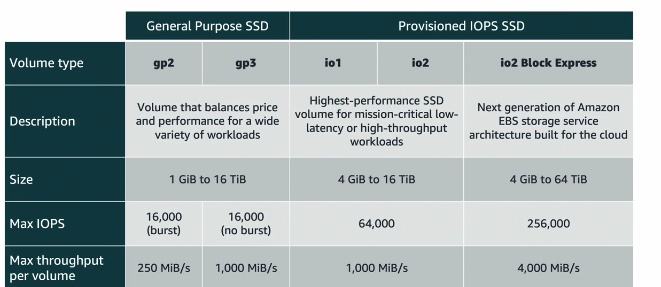
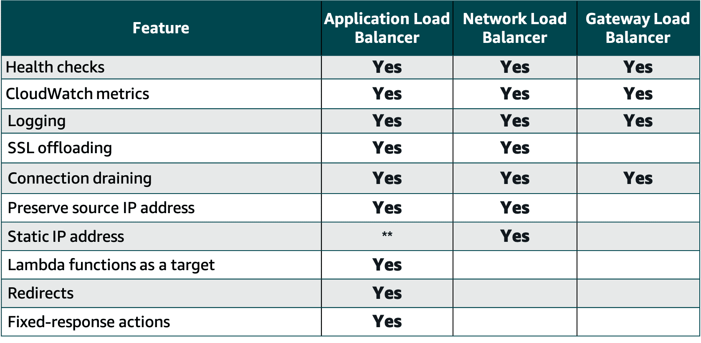

# Compute 

## EC2

### Main items are

* EC2
* AMI
* EC2 key pair

### EC2 instance families:

* General purpose
  * Balance of compute, memory and networking
  * Diverse workloads
  * Web applications

* Compute optimized
  * Compute-bound applications
  * High-performance processors
  * Media transcoding
  * Scientific modeling
  * Machine learning

* Memory optimized
  * Fast delivery of large datasets in memory
  * Database servers
  * Web caches
  * Data analytics

* Accelerated computing
  * High-graphics processing
  * GPU bound
  * Machine learning
  * High performance computing (HPC)
  * Autonomous vehicles

* Storage optimized
  * High sequential read/write
  * Large datasets
  * NoSQL databases
  * Amazon OpenSearch Service

* EC2 Tenancy
    * shared
    * Dedicated instance
    * Dedicated Host

* Placement Groups
  * Cluster
    * for HPC, low ltency, high throuput
  * Spread
    * for critical workloads - for fault tolerance
  * Partition
    * Kafka, Hadoop, Cassandra etc

### Stoarge on EC2
    * EBS
    * Instance Store Disk
        * attached to EC2 instance
        * non persistant

### Pricing
    * On Demand
    * Savings Plan
        * 1 or 3 years of commitment
        * Compute savings plan
            * across instance family, region/AZ , tenancy
        * Instance Savings plan
            * across size, OS, AZ and tenancy
    * Spot

----

----

## AWS Batch

* plan, schedule and execute batch jobs
* works with AWS Fargate
* can also use EC2, Spot included

## Serverless

### AWS Lambda

* xxx

---- 

### API Gateway

* Amazon API Gateway to create, publish, maintain, monitor, and secure APIs

### SQS

* Amazon Simple Queue Service (Amazon SQS) to create a message queue for reliable service-to-service communication

### SNS

* Amazon Simple Notification Service (Amazon SNS) to send push notifications

### Amazon Kinesis

* Amazon Kinesis to ingest streaming data

  * Amazon Kinesis Data Streams
  * Amazon Kinesis Data Firehose
  * Amazon Kinesis Data Analytics
  * Amazon Kinesis Video Streams

### AWS Step Functions

* AWS Step Functions facilitates workflows between functions and services

    visual workflow service that helps developers use AWS services to build distributed applications, automate processes, orchestrate microservices, and create data and machine learning (ML) pipelines.

## Containers

### ECS

### EKS

## Elastic Beanstalk

* automatically handles the deployment details of capacity provisioning, load balancing, auto-scaling, and application health monitoring

## Amazon Lightsail 

* virtual private server (VPS) provider
* a solution to build and host their applications on AWS Cloud
* provides developers with compute, storage, and networking capacity and capabilities to deploy and manage websites and web applications in the cloud
* provides low-cost, pre-configured cloud resources for simple workloads just starting on AWS
